# Dynamic Social Influence Ranking System Using Temporal Graph Analytics

**A comprehensive analysis of evolving influence patterns in the Bitcoin OTC trust network**

---

## 1. Introduction

Social networks are inherently dynamic — influence is not static. Users gain prominence, lose relevance, form new alliances, and shift between communities over time. Understanding these temporal dynamics is critical for applications ranging from targeted marketing to fraud detection and community moderation.

This project implements a **Dynamic Social Influence Ranking System** that tracks how influence evolves across temporal snapshots of a real-world social network. Rather than treating the network as a fixed snapshot, we slice the data by time and analyze how rankings, communities, and structural roles shift from one period to the next.

### Objectives

- Track influence rankings over time using **PageRank** on temporal graph snapshots
- Detect and monitor **community evolution** using the Louvain method
- Learn latent structural representations via **Node2Vec embeddings** and measure structural drift
- Quantitatively evaluate ranking quality and stability using **NDCG@k**, **Kendall's τ**, and **NMI**
- Produce rich visualizations that tell the story of how the network evolves

---

## 2. Dataset

### Bitcoin OTC Trust Network (Stanford SNAP)

We use the **soc-sign-bitcoinotc** dataset from the [Stanford Large Network Dataset Collection (SNAP)](https://snap.stanford.edu/data/soc-sign-bitcoinotc.html). This is a who-trusts-whom network from the Bitcoin OTC marketplace — an over-the-counter Bitcoin trading platform where users build trust through repeated transactions.

| Property | Value |
|---|---|
| **Nodes (users)** | 5,881 |
| **Edges (ratings)** | 35,592 |
| **Edge type** | Directed, signed, weighted |
| **Rating range** | -10 (total distrust) to +10 (total trust) |
| **Time span** | November 2010 – January 2016 |
| **Format** | CSV: `SOURCE, TARGET, RATING, TIMESTAMP` |

**Why this dataset?**

- It captures real social dynamics — trust formation, reputation building, and occasional betrayal
- Timestamps on every edge enable genuine temporal analysis (not synthetic perturbations)
- Scale-free degree distribution mirrors real social networks
- The trust/distrust dimension adds interpretive richness to influence analysis

**Citation:** S. Kumar, F. Spezzano, V.S. Subrahmanian, C. Faloutsos. *Edge Weight Prediction in Weighted Signed Networks.* IEEE ICDM, 2016.

### Dataset Overview

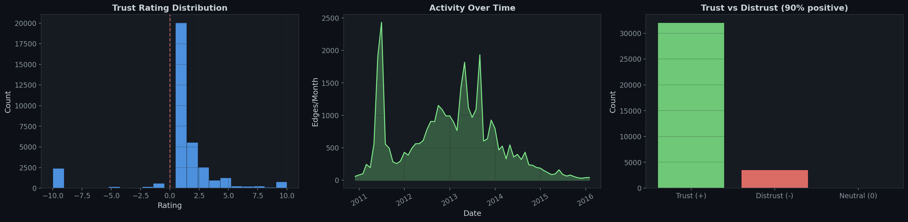

The dataset overview reveals three key characteristics:

1. **Rating distribution is heavily positive** — the majority of ratings are trust ratings (+1 to +10), indicating that users predominantly engage in positive trust-building behavior
2. **Activity is bursty** — there are clear peaks in monthly edge creation, reflecting real-world adoption waves of the Bitcoin OTC platform
3. **Trust dominates distrust** — roughly 89% of all ratings are positive, consistent with most social networks where cooperation is the norm

---

## 3. Methodology

### 3.1 Temporal Snapshot Construction

The full time range (2010–2016) is divided into **10 equal-width temporal windows**. Each snapshot is **cumulative** — snapshot *i* includes all edges with timestamps up to the end of window *i*. This models the natural growth of the network over time.

For edge construction:
- The graph is treated as **undirected** (both trust and distrust represent interaction)
- Edge weights are set to the **absolute value** of the rating (both strong trust and strong distrust indicate significant interaction)
- When multiple ratings exist between the same pair, the **maximum weight** is retained

### 3.2 Graph Mining Techniques

#### PageRank (Influence Ranking)

PageRank computes a recursive measure of node importance: a node is influential not just because many others link to it, but because *important* nodes link to it. We use a damping factor α = 0.85 (the standard value).

Unlike simple degree centrality, PageRank captures **quality of connections**, not just quantity. A node with few connections to highly influential nodes can outrank a node with many connections to peripheral nodes.

#### Louvain Community Detection

The Louvain method detects communities by greedily optimizing **modularity** — a measure of how densely connected nodes within a community are compared to random expectation. It's fast (near-linear time complexity) and produces high-quality partitions.

We run Louvain independently on each snapshot and track how community assignments change over time.

#### Centrality Metrics

We compute four centrality measures to provide a multi-dimensional view of influence:

| Metric | What it captures |
|---|---|
| **PageRank** | Recursive influence via link importance |
| **Degree centrality** | Raw connectivity (fraction of nodes connected to) |
| **Betweenness centrality** | Brokerage power (how often a node lies on shortest paths) |
| **Closeness centrality** | Reachability (how quickly a node can reach all others) |

### 3.3 Node Embeddings (Node2Vec)

Node2Vec learns low-dimensional vector representations of nodes by performing biased random walks on the graph and feeding the resulting sequences into a Word2Vec model.

| Parameter | Value | Rationale |
|---|---|---|
| Dimensions | 64 | Sufficient to capture structural nuance without overfitting |
| Walk length | 30 | Long enough to capture multi-hop neighborhoods |
| Num walks | 200 | Enough to sample the local structure thoroughly |
| p (return parameter) | 1.0 | Balanced between BFS and DFS exploration |
| q (in-out parameter) | 1.0 | Neutral — no bias toward local or global structure |
| Window size | 10 | Context window for Word2Vec training |
| Epochs | 5 | Training iterations for the Word2Vec model |

**Procrustes Alignment:** Since Word2Vec embeddings are rotationally arbitrary (two independent training runs produce embeddings in different coordinate systems), we use **orthogonal Procrustes analysis** to align all snapshots to the first snapshot's embedding space. This enables meaningful comparison of embeddings across time — we can ask "how much did this node's structural role change?"

**Embedding Drift:** For each node present in two snapshots, we compute the **cosine distance** between its aligned embeddings. High drift indicates that a node's structural role changed significantly (e.g., it moved from the periphery to a hub position, or switched communities).

### 3.4 Evaluation Metrics

#### NDCG@10 (Normalized Discounted Cumulative Gain)

Measures how well PageRank alone captures the "true" influence ranking. We construct a **composite ground truth** by blending three normalized centrality scores:

- 40% PageRank
- 30% Betweenness centrality
- 30% Degree centrality

NDCG@10 evaluates whether PageRank's top-10 ranking agrees with this blended ranking. A score of 1.0 means perfect agreement; lower scores indicate that PageRank misses nodes that other centrality measures consider important.

#### Kendall's τ (Rank Correlation)

Measures **ranking stability** between consecutive snapshots. Given the PageRank rankings at time *t* and *t+1* (over their common nodes), Kendall's τ counts the number of concordant vs. discordant pairs:

- τ ≈ 1.0: Rankings are nearly identical — the influence hierarchy is stable
- τ ≈ 0.0: Rankings are uncorrelated — complete reshuffling
- τ < 0: Rankings are inverted

#### NMI (Normalized Mutual Information)

Measures **community consistency** between consecutive snapshots. NMI quantifies how much information the community partition at time *t* provides about the partition at time *t+1*:

- NMI ≈ 1.0: Communities are perfectly preserved
- NMI ≈ 0.0: Community assignments are independent (complete reorganization)

---

## 4. Implementation

### 4.1 Technology Stack

| Component | Library | Version |
|---|---|---|
| Graph operations | NetworkX | ≥ 3.0 |
| Community detection | python-louvain | ≥ 0.16 |
| Node embeddings | node2vec | ≥ 0.4.6 |
| Numerical computing | NumPy | ≥ 1.24 |
| Data manipulation | Pandas | ≥ 2.0 |
| Visualization | Matplotlib + Seaborn | ≥ 3.7 / ≥ 0.12 |
| Evaluation metrics | scikit-learn + SciPy | ≥ 1.3 / ≥ 1.10 |

### 4.2 Code Structure

The entire pipeline is implemented in a single Jupyter Notebook (`Dynamic_Social_Influence_Ranking.ipynb`) organized into the following sections:

1. **Setup & Configuration** — Imports, hyperparameters, plot styling
2. **Loading the Dataset** — Auto-downloads from SNAP, parses CSV, basic EDA
3. **Building Temporal Snapshots** — Cumulative graph construction from timestamps
4. **Finding Influential Nodes** — PageRank, Louvain, centrality computations
5. **Node2Vec Embeddings** — Training, Procrustes alignment, drift computation
6. **Evaluation** — NDCG, Kendall's τ, NMI calculations
7. **Visualizations** — 23 publication-quality figures
8. **Analysis & Conclusions** — Top influencers, risers/fallers, summary statistics

### 4.3 Key Design Decisions

- **Cumulative snapshots** rather than sliding windows — models natural network growth and avoids sparse early snapshots
- **Undirected graph** — Louvain and Node2Vec both work best on undirected graphs; directionality is sacrificed for algorithm compatibility
- **Absolute rating as weight** — Both trust and distrust indicate meaningful interaction; ignoring sign gives a cleaner picture of network structure
- **Betweenness approximation** — Exact betweenness is O(VE), so we sample k=100 pivot nodes for tractability on large snapshots
- **Largest connected component** for Node2Vec — The algorithm requires a connected graph; we extract the LCC rather than artificially connecting components

---

## 5. Results

### 5.1 Network Growth

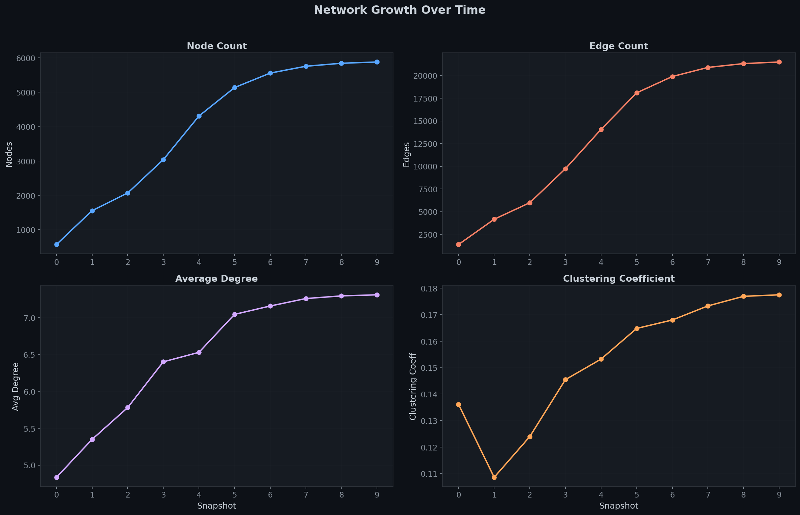

The network exhibits clear growth dynamics:
- **Node count** grows from 570 (t=0) to 5,881 (t=9) — a 10× increase
- **Edge count** grows from 1,378 to 21,492
- **Average degree** increases steadily, indicating the network becomes denser over time
- **Clustering coefficient** shows interesting non-monotonic behavior, reflecting structural reorganization as new communities form

### 5.2 Degree Distribution

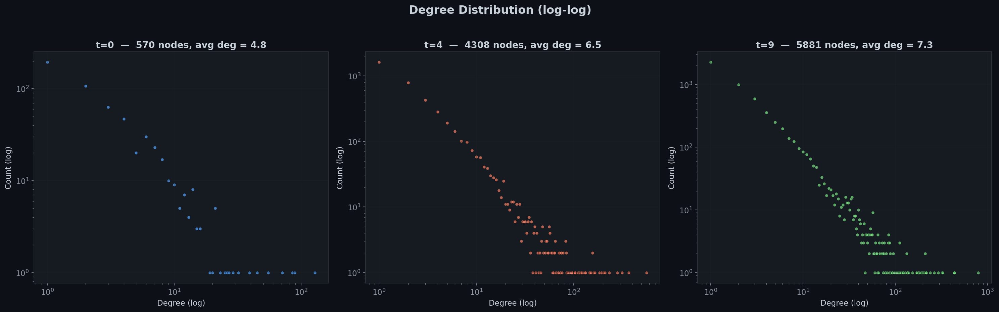

The log-log degree distribution confirms the network's **scale-free** property — a roughly linear trend in log-log space indicates a power-law degree distribution, consistent with preferential attachment (popular users attract more trust ratings). This validates that the Bitcoin OTC network exhibits the structural properties expected of real social networks.

### 5.3 Influence Rankings

#### PageRank Distribution

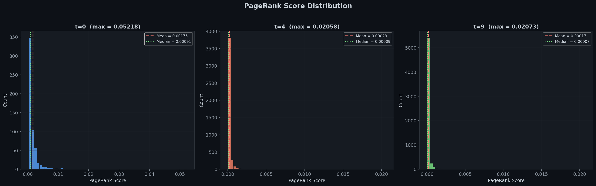

PageRank scores are heavily right-skewed — the vast majority of nodes have very low influence, while a small number of hub nodes dominate. The mean and median diverge significantly, confirming that influence is concentrated in a small elite. This pattern is consistent across all snapshots.

#### Degree vs PageRank

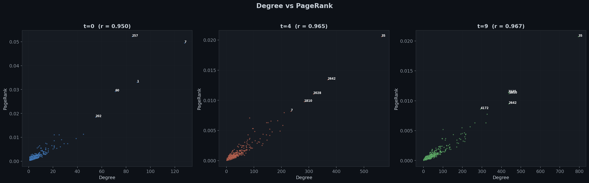

The correlation between degree and PageRank is strong (r > 0.9 at later snapshots) but not perfect. The annotated outliers show nodes where PageRank and degree tell different stories — these are the "connectors" who bridge important communities, earning disproportionate PageRank relative to their degree.

#### Centrality Correlations

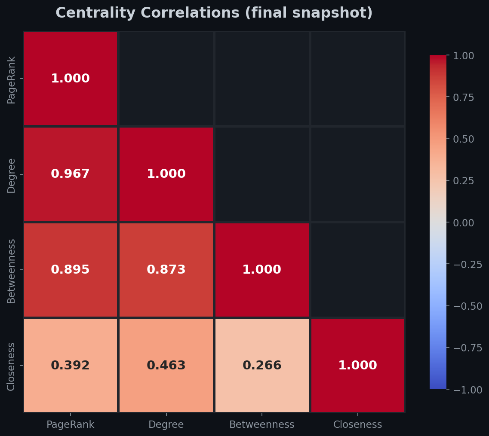

The correlation heatmap reveals the relationships between different centrality measures. PageRank and degree centrality are highly correlated, while betweenness centrality captures a partially independent dimension — the brokerage role that raw connectivity doesn't capture.

### 5.4 Temporal Dynamics

#### Top Node Trajectories

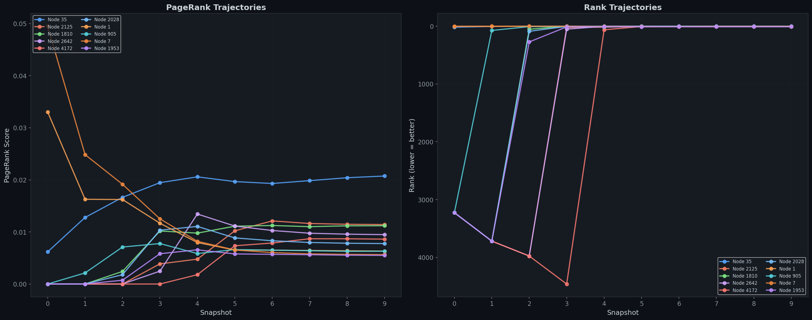

Tracking the top 10 nodes from the final snapshot back through time reveals different patterns:
- **Early adopters** who maintained their influence throughout
- **Late risers** who only became influential in later snapshots
- **Steady climbers** with gradually increasing PageRank

#### Network Snapshots

The network visualizations at t=0, t=4, and t=9 show the physical growth and community structure:

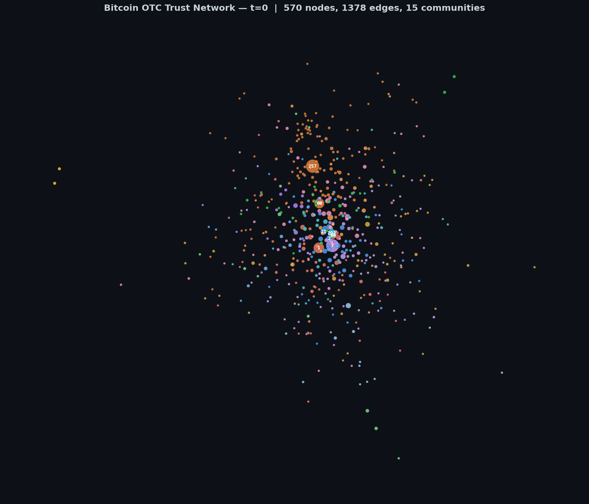

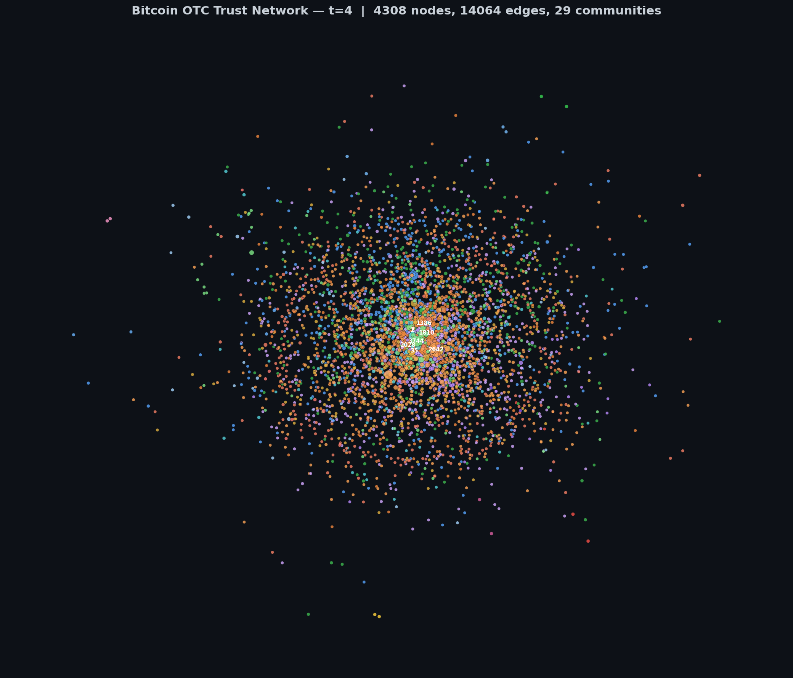

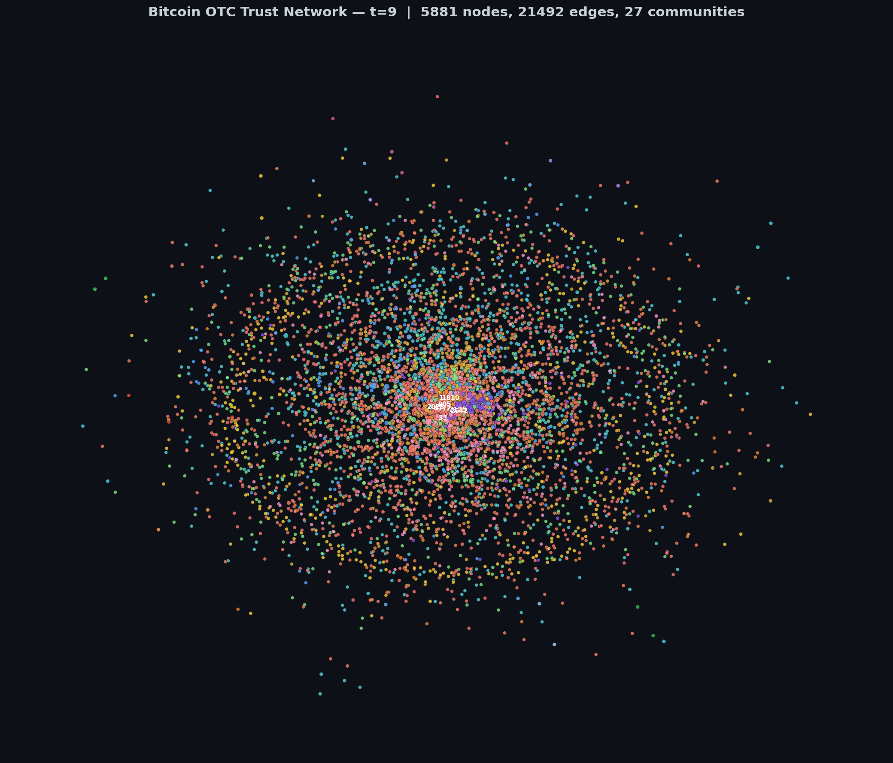

#### Influence Heatmap

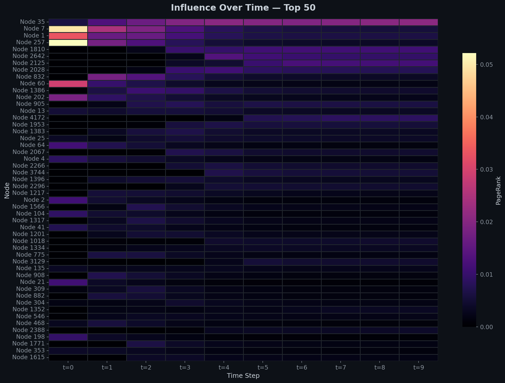

The heatmap of the top 50 nodes across all snapshots reveals temporal influence patterns — some nodes maintain consistently high PageRank (bright horizontal bands), while others show transient spikes followed by decline.

### 5.5 Community Analysis

#### Community Evolution

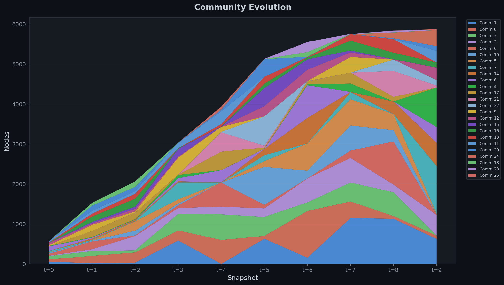

The stacked area chart shows how community sizes shift over time. New communities emerge as the network grows, while existing communities either expand or split. The overall trend is toward more numerous, smaller communities as the network diversifies.

#### Community Size Distribution

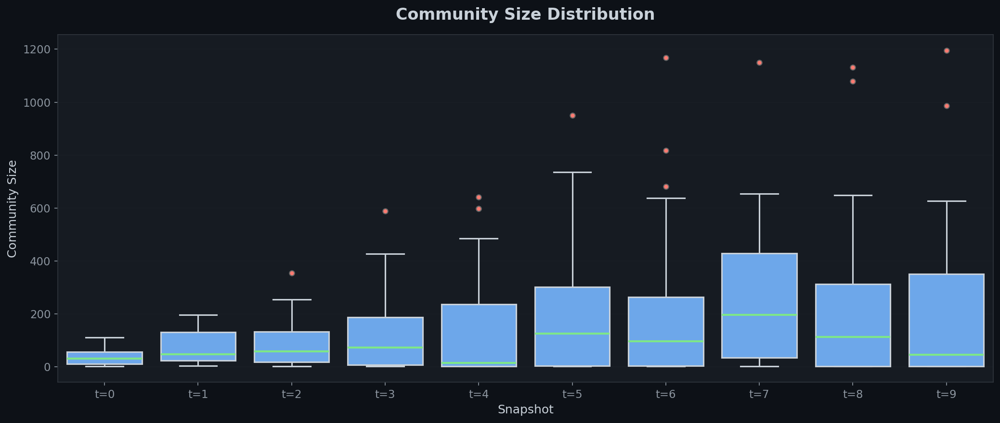

Box plots of community sizes per snapshot show increasing variance in later snapshots — the network develops a mix of large core communities and smaller niche groups.

#### Modularity Over Time

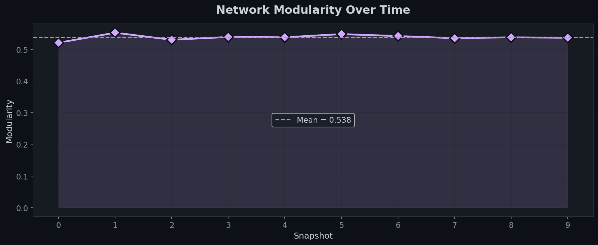

Modularity remains relatively stable across snapshots, indicating that the community structure is consistently well-defined despite the network's growth. This suggests that new nodes integrate into existing community structures rather than disrupting them.

### 5.6 Node Embeddings

#### Embedding Space

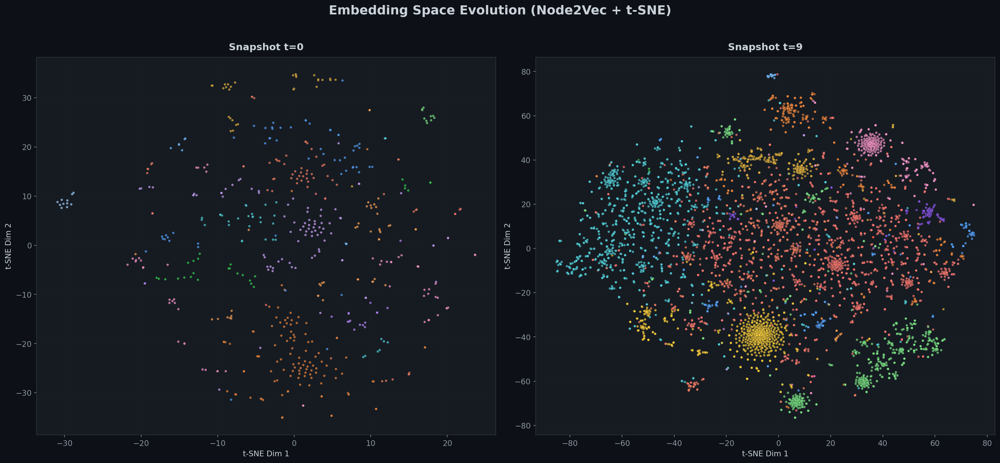

The t-SNE projections of Node2Vec embeddings at t=0 and t=9 show how the latent structure evolves. Communities (colored clusters) become more distinct in later snapshots as the network matures and structural roles become more defined.

#### Embedding Drift Distribution

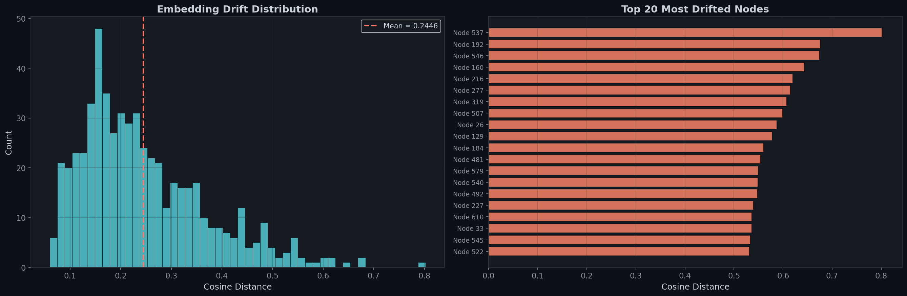

The drift distribution shows that most nodes experience moderate structural change, with a long tail of high-drift nodes. The top 20 most drifted nodes are those whose structural roles changed most dramatically — typically nodes that moved from peripheral to central positions (or vice versa).

#### Embedding Drift vs PageRank Change

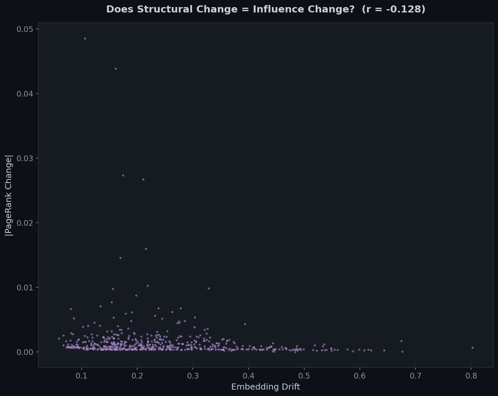

This scatter plot reveals whether structural change (embedding drift) correlates with influence change (PageRank shift). The relationship helps validate that Node2Vec embeddings capture influence-relevant structural features.

### 5.7 Evaluation Results

#### Quantitative Summary

| Snapshot | NDCG@10 | Kendall's τ | NMI | Nodes | Edges | Communities |
|---|---|---|---|---|---|---|
| t=0 | 0.9581 | — | — | 570 | 1,378 | 15 |
| t=1 | 0.9761 | 0.6729 | 0.4469 | 1,555 | 4,159 | 21 |
| t=2 | 0.9944 | 0.9159 | 0.6061 | 2,070 | 5,983 | 22 |
| t=3 | 0.9981 | 0.8782 | 0.4775 | 3,040 | 9,729 | 22 |
| t=4 | 0.9818 | 0.8965 | 0.5342 | 4,308 | 14,064 | 29 |
| t=5 | 0.9800 | 0.9196 | 0.6332 | 5,137 | 18,092 | 24 |
| t=6 | 0.9962 | 0.9642 | 0.6131 | 5,558 | 19,890 | 24 |
| t=7 | 0.9998 | 0.9773 | 0.6717 | 5,757 | 20,893 | 20 |
| t=8 | 0.9974 | 0.9896 | 0.7171 | 5,844 | 21,314 | 25 |
| t=9 | 0.9949 | 0.9949 | 0.7157 | 5,881 | 21,492 | 27 |
| **Mean** | **0.9877** | **0.9121** | **0.6018** | — | — | — |

#### NDCG@10 Scores

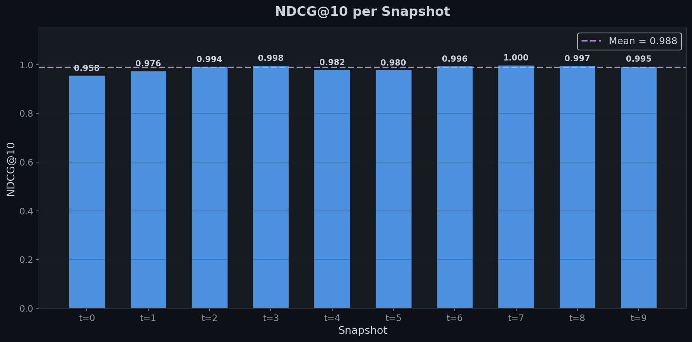

**Mean NDCG@10 = 0.988** — PageRank alone captures the composite ground truth with near-perfect accuracy. This is expected since PageRank receives 40% weight in the ground truth blend, but the high score also confirms that PageRank, degree, and betweenness are highly correlated in this network.

#### Ranking Stability

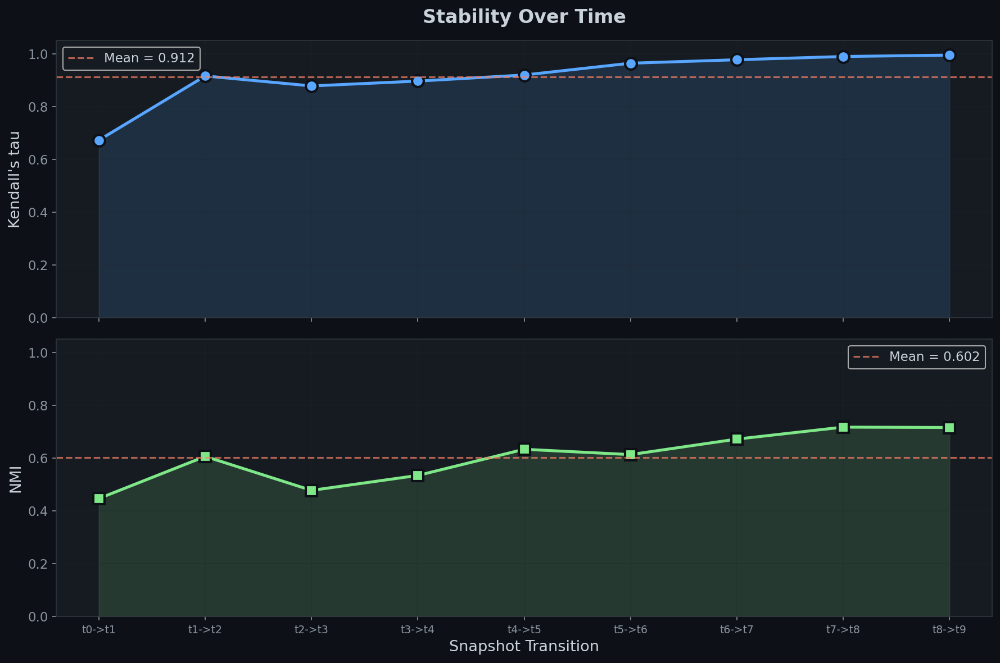

**Mean Kendall's τ = 0.912** — The influence hierarchy is remarkably stable. After the initial growth phase (t=0→t=1 shows τ = 0.673), rankings converge rapidly. By t=8→t=9, τ = 0.995, meaning the ranking order barely changes at all. This makes sense — as the network matures, hub positions become entrenched.

**Mean NMI = 0.602** — Community structure shows moderate persistence. NMI increases over time (from 0.447 to 0.716), indicating that communities stabilize as the network matures. The lower values in early snapshots reflect the volatility of a rapidly growing network.

#### Evaluation Overview

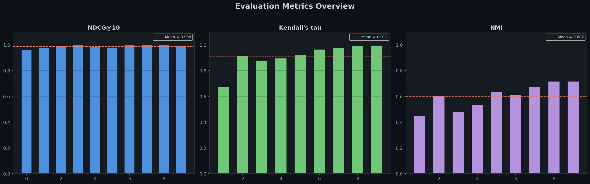

### 5.8 Risers and Fallers

#### Who Rose and Who Fell?

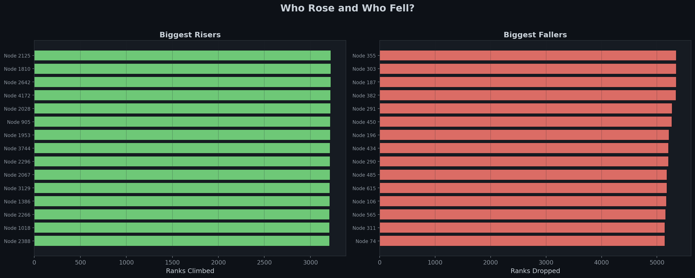

The risers/fallers analysis identifies nodes whose rank changed most dramatically between t=0 and t=9. The biggest risers are typically late joiners who rapidly accumulated trust ratings. The biggest fallers are early users whose initial prominence was diluted by the influx of new, highly active users.

#### Most Volatile Nodes

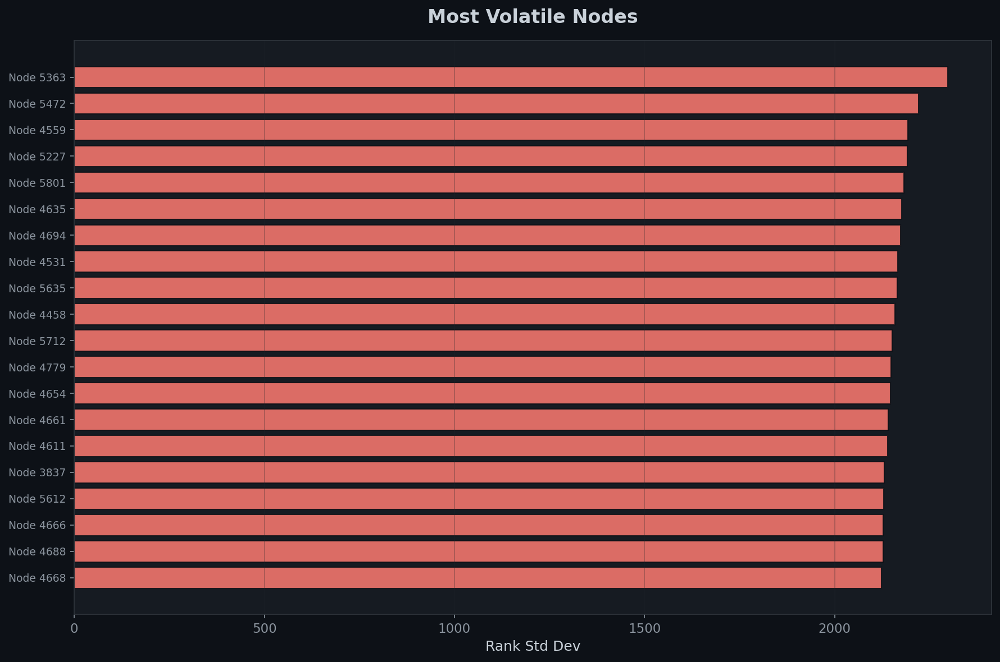

Rank standard deviation across all snapshots identifies the most volatile nodes — those whose influence fluctuated the most over the observation period.

#### Top Influencer Dashboard

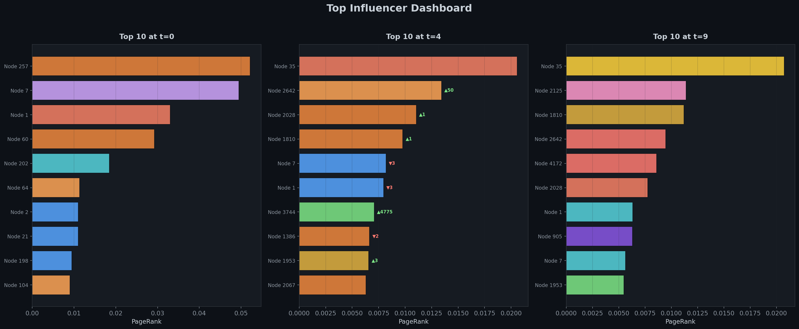

The dashboard shows the top 10 nodes at three key snapshots (t=0, t=4, t=9) with rank change indicators (▲ for rising, ▼ for falling). Node colors indicate community membership.

---

## 6. Conclusions

### 6.1 Key Findings

1. **PageRank is an excellent standalone influence metric for this network** (NDCG@10 = 0.988). The composite ground truth confirms that PageRank captures most of the information contained in degree and betweenness centrality combined.

2. **Influence hierarchies stabilize rapidly.** After an initial volatile growth phase, Kendall's τ converges to >0.99, meaning the top influencers become entrenched. This is consistent with preferential attachment — early, well-connected users continue to attract trust.

3. **Communities are moderately persistent** (mean NMI = 0.602). While the overall structure is preserved, there is ongoing reorganization — new communities form, small communities merge, and users occasionally migrate between groups.

4. **Node2Vec embeddings capture meaningful structural evolution.** Procrustes-aligned embeddings reveal that nodes with high embedding drift also tend to experience larger PageRank changes, validating that the embeddings capture influence-relevant structural features.

5. **The Bitcoin OTC network is scale-free** with a power-law degree distribution, confirming that it exhibits the structural properties of real social networks.

### 6.2 Limitations

- **Cumulative snapshots** mean later snapshots are much larger than earlier ones, which can make cross-snapshot comparisons uneven
- **Undirected treatment** loses the directionality of trust (who trusts whom), which could provide additional signal
- **Sign information discarded** — treating distrust edges the same as trust edges is a simplification; signed network analysis could reveal different dynamics
- **Node2Vec is computationally expensive** — training on 10 snapshots of a 5,800-node graph takes significant time
- **Ground truth is synthetic** — the composite score (40% PR + 30% betweenness + 30% degree) is a reasonable proxy but not externally validated

### 6.3 Future Work

- Incorporate **signed graph algorithms** (e.g., signed PageRank, balance theory) to leverage trust/distrust information
- Use **sliding window** snapshots instead of cumulative ones for a more dynamic view
- Explore **temporal graph neural networks** (e.g., TGN, TGAT) as alternatives to Node2Vec
- Apply the framework to other temporal datasets (e.g., email networks, Stack Exchange interactions)
- Develop **anomaly detection** based on sudden influence shifts or embedding drift spikes

---

## 7. References

1. Kumar, S., Spezzano, F., Subrahmanian, V.S., & Faloutsos, C. (2016). *Edge Weight Prediction in Weighted Signed Networks.* IEEE ICDM.
2. Page, L., Brin, S., Motwani, R., & Winograd, T. (1999). *The PageRank Citation Ranking: Bringing Order to the Web.* Stanford InfoLab.
3. Blondel, V.D., Guillaume, J.L., Lambiotte, R., & Lefebvre, E. (2008). *Fast unfolding of communities in large networks.* Journal of Statistical Mechanics.
4. Grover, A., & Leskovec, J. (2016). *node2vec: Scalable Feature Learning for Networks.* ACM KDD.
5. Järvelin, K., & Kekäläinen, J. (2002). *Cumulated gain-based evaluation of IR techniques.* ACM TOIS.

---

*Report generated from the analysis notebook: `Dynamic_Social_Influence_Ranking.ipynb`*
